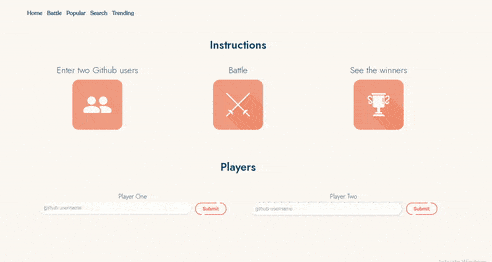

<h1 align="center">
  	 
    
  GithubSquare
</h1>

   
  

  :fire: <b>GithubSquare</b> is a Vanilla JavaScript App that pulls data from Github API and let's you explore the most starred projects , trending developers , popular repositories of any date and let's you face off Github Profiles of your choice. :fire:

|Trending|BattlPopular|
|--------|---------|------------------|
||||
