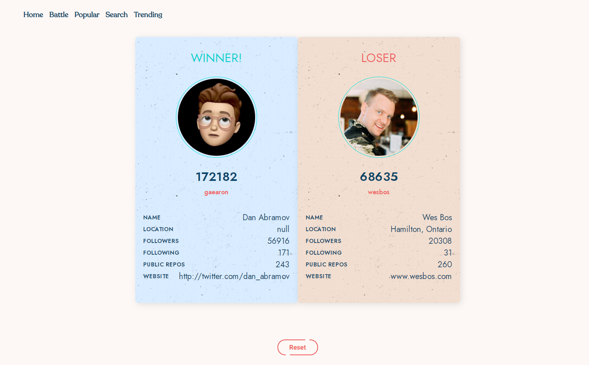
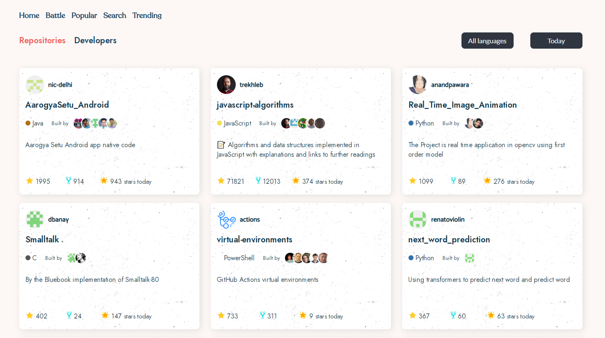
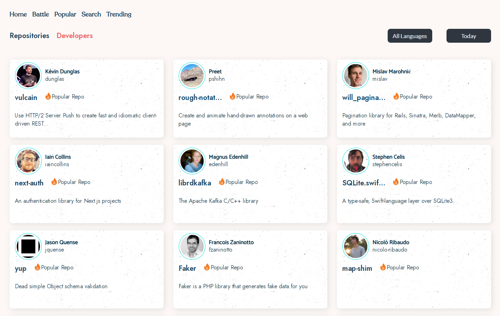
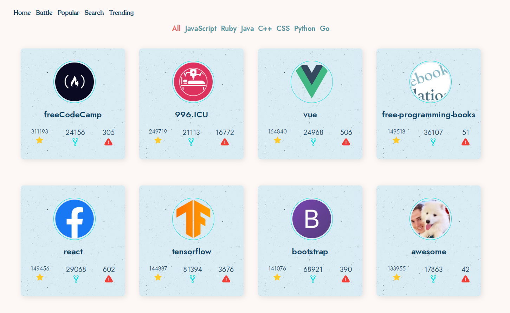
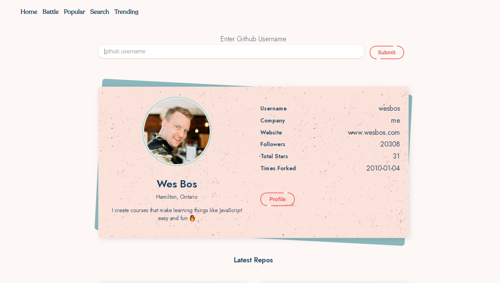

<h1 align="center">
  	 
    
  GithubSquare
</h1>

   
  

  :fire: <b>GithubSquare</b> is a Vanilla JavaScript App that pulls data from Github API and let's you explore the most starred projects , trending developers , popular repositories of any date and let's you face off Github Profiles of your choice. :fire:

   
    
  <b>Github Battle</b> 
  💥 Using a simple algo to decide the winner 💥Trending Repos</b> 
  💥 Using Local Storage to save the language/duration selected 💥
 

 
 
 

   
   
  <b>Trending Developers</b> 
  💥 Use filter to change languages 💥
 

 
 

   
   
  <b>Popular Repos</b> 
   
  💥 Get 30 most popular repos of selected language 💥
 

 
 

   
   
  <b>Search Page</b> 
  💥 Search your favourite profiles 💥
 

 
 
 ## Contributions

* Spread the word
* Open pull requests

## Supporting GithubSquare
If you like GithubSquare, you can give a star ⭐ on [GitHub](https://github.com/aakashsr/GithubSquare), or help spread GithubSquare to more people you know.

## Thanks

* GithubSquare is using [huchenme/github-trending-api](https://github.com/huchenme/github-trending-api)

## License
MIT © [Aakash Srivastav](https://aakashdev.me)
